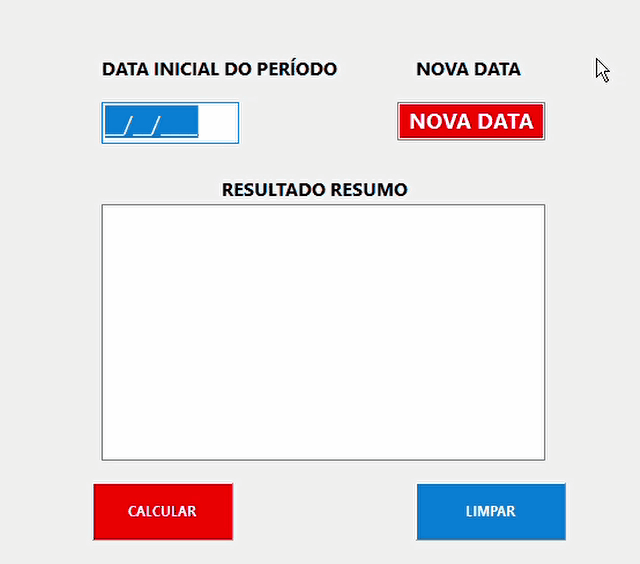

# 🛠️ Ferramentas de Automação de Cálculos - Recursos Humanos

## 📌 Sobre o Projeto

Este repositório é uma **demonstração visual (showcase)** de duas aplicações desktop desenvolvidas para modernizar e trazer precisão aos cálculos em ambientes de administração pública.

O objetivo principal dessas ferramentas foi substituir o uso de calculadoras manuais e com softwares já desatualizados, eliminando o risco de erros de digitação e cálculos incorretos. Com interfaces diretas e focadas na usabilidade do setor administrativo, as aplicações garantem agilidade na rotina dos setores.

🔒 **Aviso de Propriedade:** Por se tratar de um software desenvolvido para atender a uma demanda interna corporativa, **o código-fonte deste projeto é privado**. Este repositório tem fins estritamente de portfólio, exibindo o funcionamento visual (GIFs), sem expor regras de negócio internas ou dados de terceiros.

---

## 🚀 Aplicações Desenvolvidas

### 1. Calculadora de Triênios (LC 226/2026)
Ferramenta para automatizar o fechamento de períodos aquisitivos.
* **O Problema:** O cálculo exigia digitação manual constante de datas, com auxilio de sofwares contadores desatualizados sujeitas a falhas durante a contagem pelos servidores do setor.
* **A Solução:** Uma interface limpa onde o usuário insere a *Data Inicial* e a *Data Limite*. O sistema processa e exibe uma tabela de resultados clara, pronta para uso em processos.

<strong>
  <h3 align="center">Demonstração</h3>
</strong>
  

  

### 2. Calculadora ATS (Adicional por Tempo de Serviço)
Software focado em consolidar tempos de serviço de forma rápida e segura.
* **O Problema:** A soma de diferentes períodos causava confusão e retrabalho durante o processo manual.
* **A Solução:** Uma aplicação que permite a inserção das datas e gera um relatório compilado na mesma tela, garantindo a contagem exata.

<strong>
  <h3 align="center">Demonstração</h3>
</strong>
  

  

---

## 💻 Tecnologias Utilizadas
* **Linguagem:** Object Pascal
* **IDE:** Lazarus IDE / Free Pascal
* **Arquitetura:** Aplicação Desktop Nativa (Windows)
* **Foco Técnico:** UI/UX para alta produtividade administrativa, lógica complexa de cálculo de datas e validação de input.

---

## 👩‍💻 Autora
**Pâmela** Estudante de Tecnologia  
[LinkedIn](https://www.linkedin.com/in/pamela-costa-20p/) | [Portfólio](https://portfolio-pamela-costa.vercel.app/)
